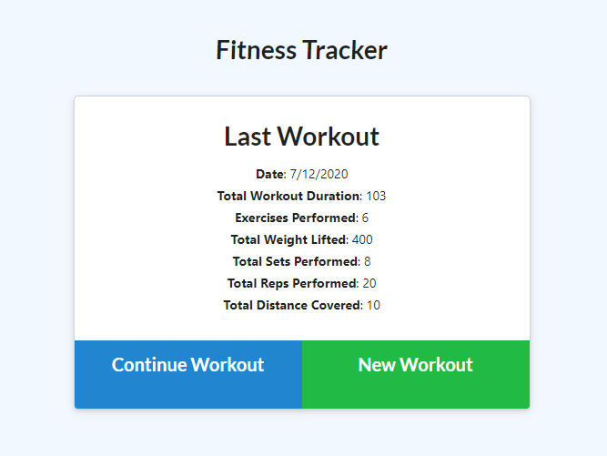
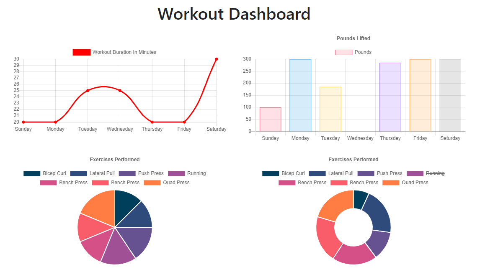

# Workout Tracker

# Homepage

## Description:
As a user, I want to be able to view, create, and track daily workouts. I want to be able to log multiple exercises in a workout on a given day. I want to also be able to track the name, type, weight, sets, reps, and duration of exercise. If the exercise is a cardio exercise, I should be able to track my distance traveled.

# Stats

## Technologies:
NodoJS, JavaScript, Mongo database, Mongoose schema, and Express routes.

## Installation:
Npm install, enter node server in terminal, and view in local host.

## License:
Client side code by Trilogy. DB, schema, and routes by Laureni Wilkinson-Sanchez
